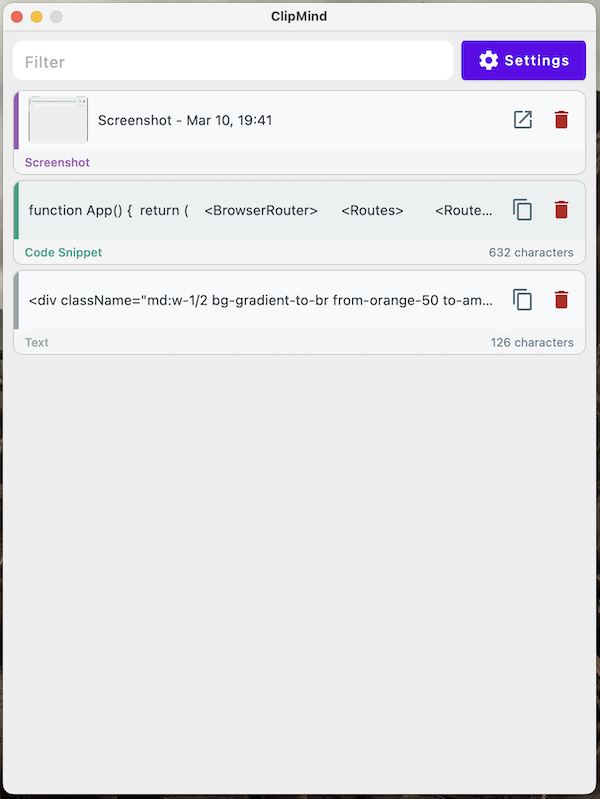

# My Digital Creations

> From web to desktop to mobile — I build the tools I need and share them with you. These passion projects solve real problems I've encountered, and I hope you find them useful too.

## Jump to Projects
* [clipMind](#clipmind) - Intelligent clipboard manager

## Projects

### 📋 clipMind

**An intelligent clipboard manager that remembers, so you don't have to**

clipMind tracks everything you copy, storing it securely within the app. Easily retrieve your copy history and access previously copied text whenever you need it.

#### Key Features

- **Complete Copy History**: Never lose important text again
- **Smart Search**: Quickly find what you copied days or weeks ago
- **Cross-platform**: Available on macOS (coming soon for Windows, Linux)

[Download clipMind](https://github.com/selcuksarikoz/apps-release/releases/tag/clipmind-release)

---

## Connect

Have feedback or suggestions? I'd love to hear from you!

- [X/Twitter](https://x.com/selcuksarikoz)
- [GitHub](https://github.com/selcuksarikoz)
- [Personal Website](https://www.selcuksarikoz.com)

---

Made with ❤️ by Selcuk Sarikoz in Berlin 🇩🇪
